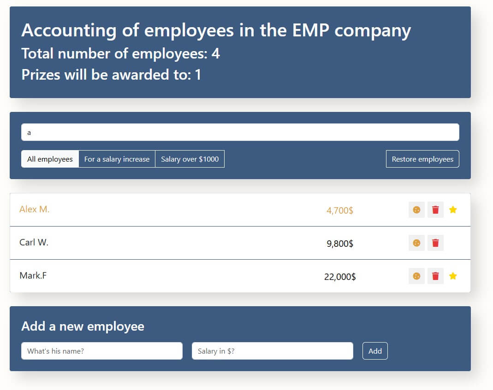

# React Employee Accounting

**React Employee Accounting** is a simple React application for managing and tracking company employees.

## Features
- 📋 Display list of employees with name and salary  
- ➕ Add new employee (name + salary)  
- 🗑 Delete employee  
- 🍪 Mark for **bonus** (click the cookie icon)  
- ⭐ Mark for **promotion** (click the employee’s name)  
- 🔍 Live search by name  
- 📊 Filters:
  - All employees  
  - Those marked for promotion  
  - Salary over $1000  
- 🔄 **Restore employees** – resets to the default list  
- 💾 Data is persisted in **Local Storage**

## Screenshot


## Tech Stack
- React (Create React App)  
- JavaScript (ES6+)  
- CSS
- Local Storage API  

## Installation & Running Locally

```bash
git clone https://github.com/VolodX/react-employee-accounting.git
cd react-employee-accounting

npm install
npm start
